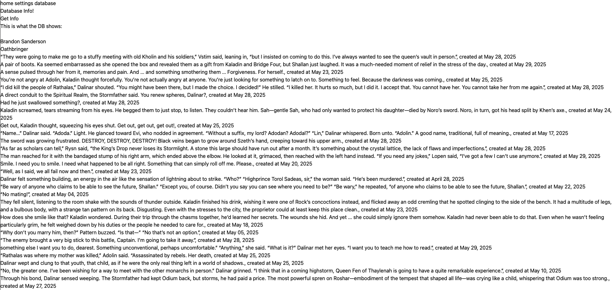

# Kobo Annotations Exporter
A tool to export annotations from your Kobo reader in a way that makes them easy to read and nice to look at.

## Table of Contents
- [Technologies Used](#technologies-used)
- [How to Install](#how-to-install)
- [Develop Locally](#develop-locally)

## <a name="technologies-used">Technologies Used</a>
- `Wails` through `Go`
- `SvelteKit` through `Svelte`
- `TailwindCSS` for styling

## <a name="how-to-install">How to Install</a>
Download the latest release from the [Releases](https://github.com/nicfitzgerald/koboannotationexporter/releases) page.

## <a name="develop-locally">Develop Locally</a>
- Install `Wails` following [the official guide](https://wails.io/docs/gettingstarted/installation)
- Confirm you have `Node` installed
- Clone the repo
- `cd` into the `frontend` folder and `npm i` to install dependencies
- In the root folder, run `wails dev` to start the development server

## Roadmap
- Add button to select a non-hardcoded database file path
- Create a better presentation for the Annotation entries
- Allow saving of the recently pulled entries
- Allow editing of the individual fields
- Create a settings page for configuration changes
